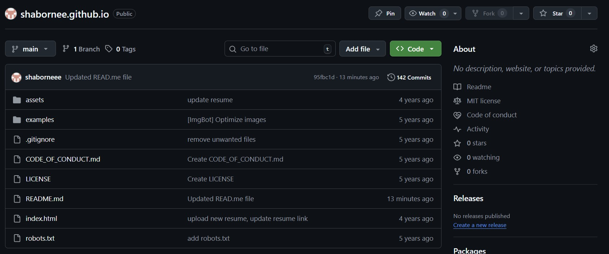
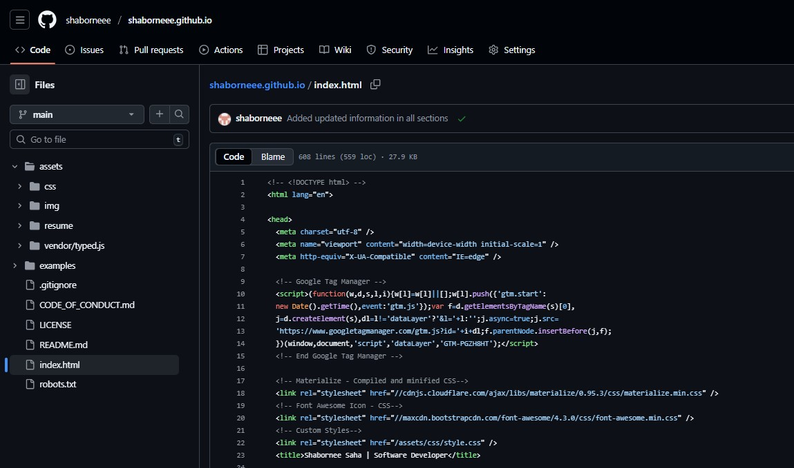
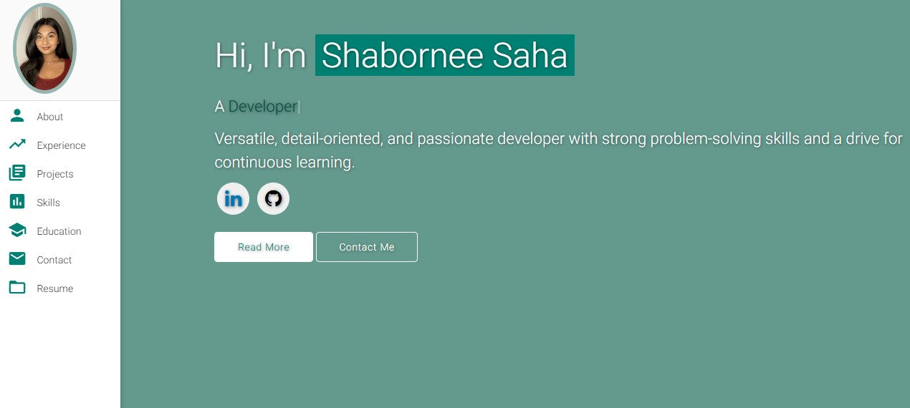
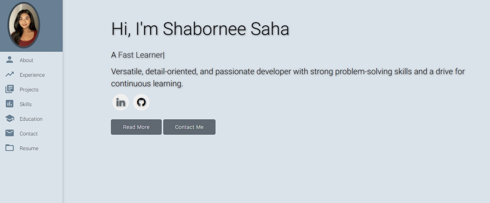
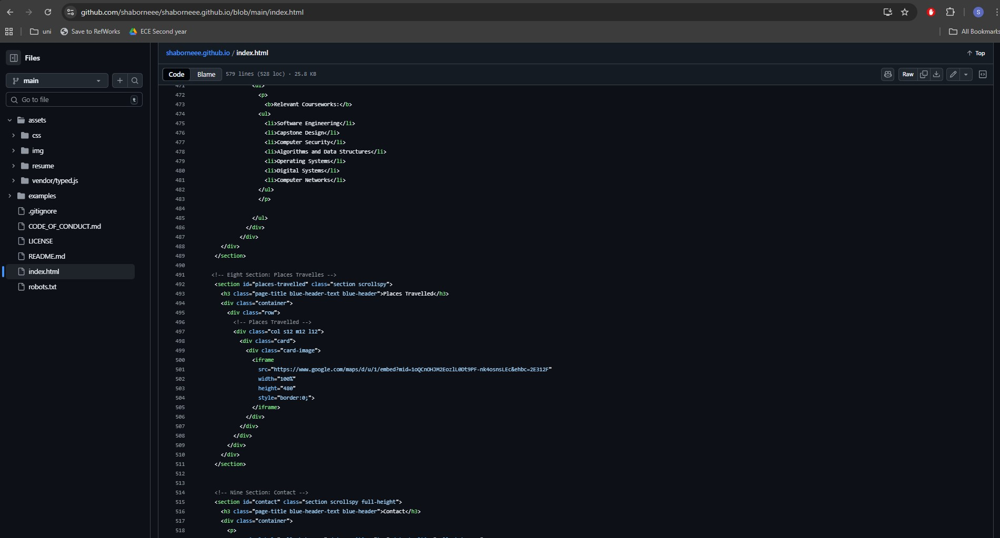
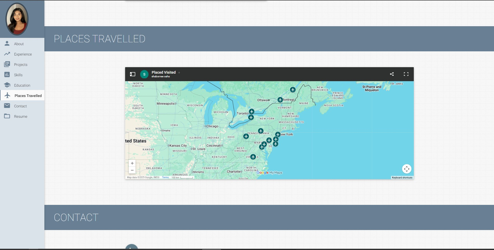
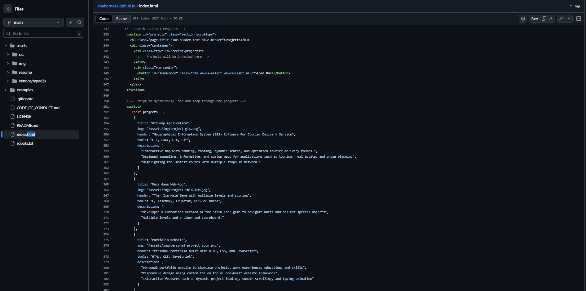
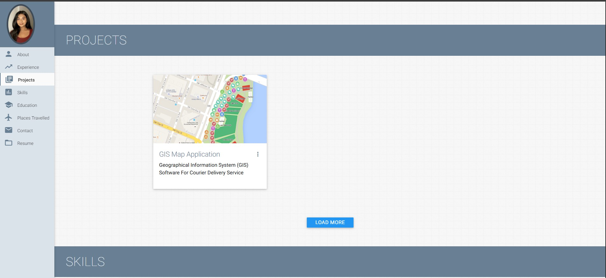

# shabornee.github.io

This repo contains my personal website.  
It is a clone of [varadbhogayata.github.io](https://github.com/varadbhogayata/varadbhogayata.github.io).  

# Activity 1 ⚡️ 
- Created public repository and cloned and updated source code and READ.me file 

# Activity 2 ⚡️ 
- Updated template with my personal information and deployed to github pages

# Activity 3 ⚡️ 
- Change the theme and colour aesthetic of the website 

# Activity 4 ⚡️ 
- Added a "Places Travelled" section with an embedded google maps

# Activity 5 ⚡️ 
- Added a "Places Travelled" section with an embedded google maps

